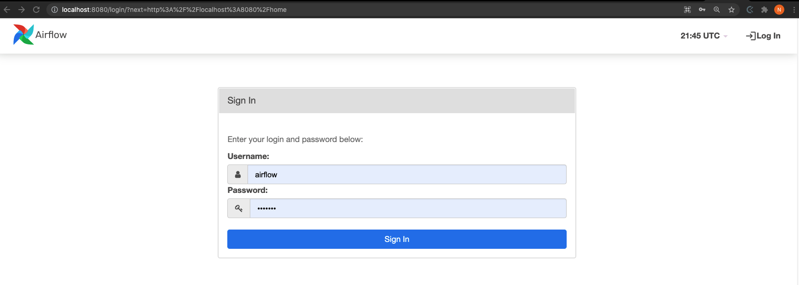
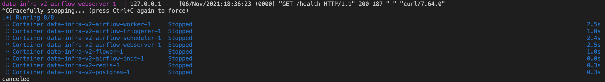
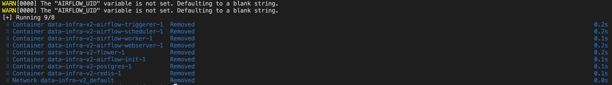
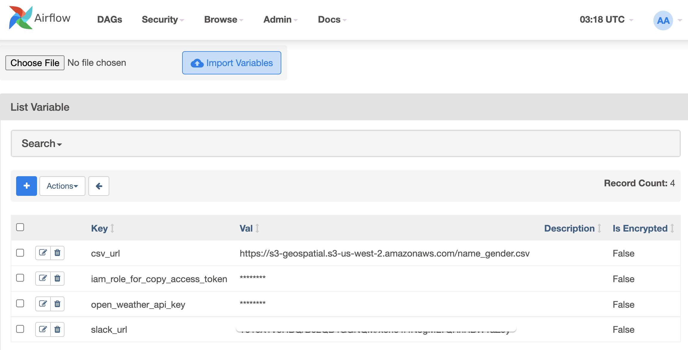
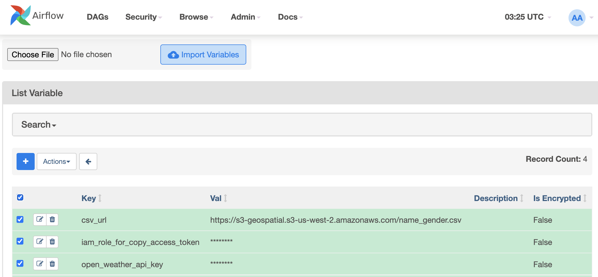

## Local Development
### One-Time Setup
#### Install Docker
Follow these steps to install the necessary tools.

1. Install [Docker Community Edition (CE)](https://docs.docker.com/engine/installation/) on your workstation. Depending on the OS, you may need to configure your Docker instance to use 4.00 GB of memory for all containers to run properly. Please refer to the Resources section if using [Docker for Windows](https://docs.docker.com/docker-for-windows/#resources>) or [Docker for Mac](https://docs.docker.com/docker-for-mac/#resources) for more information.
2. Check if you have `docker-compose` installed buy running `docker-compose --version`
3. If not installed, install [Docker Compose](https://docs.docker.com/compose/install/) v1.29.1 and newer on your workstation (I'm using `v2.0.0`)

Older versions of ``docker-compose`` do not support all the features required by ``docker-compose.yaml`` file, so double check that your version meets the minimum version requirements.


#### Docker Setting
1. Allocate at least 4GB (ideally 8GB) of memory to Docker. This is very important. You can increase the memory from Settings -> Resources -> ADVANCED menu from Docker Desktop

#### Install `pipenv`
The Docker image we use relies on `pipenv` to create a virtual environment with appropriate packages downloaded.

Run
```
$ pip3 install pipenv
```

Though the image itself has command to download `pipenv` to be used in the container, you want to make sure you can generate a `Pipfile.lock` file, since the container will ignore the `Pipfile` and use the `Pipfile.lock` to install packages.

For more information on `pipenv`, please refer to this [page](https://pipenv-fork.readthedocs.io/en/latest/basics.html).

### Spinning Up Local Airflow Services
1. Download this repo and cd into the main folder (cd data-engineering-batchN). Change N in batchN accordingly
```
git clone https://github.com/keeyong/data-engineering-batchN.git
cd data-engineering-batchN
```
3. Run `docker-compose up`
4. Go to a web browser and enter address `http://localhost:8080/`. You should see an Aiflow login page:

4. Login with
    * username: `airflow`
    * password: `airflow`
5. If login successfully, you should get to the Airflow homepage that looks similar to the one in prod and staging

### Shutting Down Local Airflow Services
1. `ctrl+c`

2. Run `docker-compose down`


### Import Airflow Local Variables from Prod
If this is the first time you've launched Airflow on your local machine, you can import all of the variables defined in prod by following the steps below:
1. Go to `http://<airflow-server-endpoint>/variable/list/`

2. Select the variables you want to import. We suggest that you import all by checking the top most checkbox

3. Select `Actions` -> `Export`
4. Go to `http://localhost:8080/variable/list/`
5. Go to `Choose File` and select the variable file you just downloaded
6. Select `Import Variables`

### Connections
There's currently no simple way to import connections from prod. The good news is that we only have 3 main connections we use: `aws_s3_default`, `mysql_default` and `redshift_default`

Please manually add these three connections on your local Airflow environment. You should use your own credentials so you have enough permissions to inspect any errors. As long as you make sure that the connection names are **identical to the ones in prod**.

If you have access to an Airflow server commandline, you can also dump the connections into a JSON file which you can import to your Docker airflow in commandline:

```
airflow connections export connections.json
```

```
airflow connections import connections.json
```


### Volumes
Since the `docker-compose.yaml` file takes care of mounting the `./dags` folder for us. You can start developing your code and create DAGs in the `./dag` folder the same way we used to do on the Airflow server. Anything you changes there should be reflected in the container locally running Airflow.

### Cleanup
It's recommended that you clean up dangling Docker images resulted from multiple build versions from time to time to free up space on your machine. To do this please run: `docker system prune`

When prompted:
```
WARNING! This will remove:
  - all stopped containers
  - all networks not used by at least one container
  - all dangling images
  - all dangling build cache

Are you sure you want to continue? [y/N]
```
please answer: `y` then hit `enter` key

### Advance Usage
#### Adding Packages
1. Add package to `requirements.txt`
2. Run `pipenv install -r requirements.txt`
3. To spin up Airflow with new changes, run `docker-compose up --build`

Note: Installing from `requirements.txt` via `pipenv` only appends packages to the `Pipfile` file. The installation does NOT remove packaged already in `Pipfile` that are not in the `requirements.txt` file
